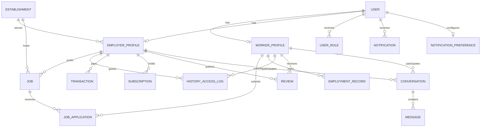

# KaziLink Database

This document describes the Django/PostgreSQL database currently implemented by the
backend. The executable source of truth is the model package under
`backend/django/apps/*/models/`; this document is the architectural reference and
must be updated whenever a model or migration changes.

## Current Schema Status

The schema is split into Django app model packages. `User` is the only identity
record; `WorkerProfile` and `EmployerProfile` are one-to-one extensions and do not
duplicate phone, email, or name fields. The current migrations include the profile,
job type, review author snapshot, notification timestamp/index, fraud timestamp,
conversation timestamp, support, audit, analytics, and other model changes described
below.

The following areas are implemented in the model layer and migrations: accounts and
profiles, establishments, jobs, applications, employment history and unlock logs,
ratings, messaging, notifications, payments, subscriptions, analytics, audit, fraud,
and support. Operational completeness still depends on applying all migrations and
running the validation commands at the end of this document.

## Database Conventions

- Database engine: PostgreSQL.
- Django app labels: `accounts`, `analytics`, `audit`, `employment_history`,
	`establishments`, `fraud`, `job_applications`, `jobs`, `messaging`,
	`notifications`, `payments`, `ratings`, `subscriptions`, and `support`.
- Primary keys use Django's default `BigAutoField`.
- All application timestamps are timezone-aware. The project timezone is
	`Africa/Nairobi`.
- PostgreSQL `ArrayField` is used for worker skills/languages and job
	requirements/benefits.
- Foreign keys use explicit deletion behavior. Sensitive historical records should
	not be hard-deleted unless their model explicitly permits it.

## Identity And Profiles

### `accounts.User`

`User` is the authentication and identity record. Phone number, email, and full name
belong here, not on `WorkerProfile` or `EmployerProfile`.

| Field | Type | Notes |
| --- | --- | --- |
| `phone` | `CharField(15)` | Unique login identifier |
| `email` | `EmailField` | Nullable and optional |
| `full_name` | `CharField(255)` | Shared display name |
| `is_worker` | `BooleanField` | Role flag |
| `is_employer` | `BooleanField` | Role flag |
| `is_phone_verified` | `BooleanField` | Phone verification state |
| `is_id_verified` | `BooleanField` | Identity verification state |
| `joined_date` | `DateTimeField` | Defaults to current time |
| `is_active` | `BooleanField` | Account availability |
| `is_staff` | `BooleanField` | Django staff access |

`User` extends `AbstractBaseUser` and `PermissionsMixin`, uses `phone` as
`USERNAME_FIELD`, and requires `full_name` when created by the user manager.

`UserRole` stores `worker`, `employer`, or `admin` role assignments and enforces a
unique `(user, role)` pair. `PhoneVerification` stores a hashed code, expiry,
attempt count, creation time, and optional verification time. `BusinessVerification`
stores employer verification documents, review status, notes, reviewer, and review
time.

### Profile extensions

- `Profile`: one-to-one general profile through `user`, with `avatar`, `bio`, and
	`location`.
- `WorkerProfile`: one-to-one extension through `user`, containing worker-specific
	skills, availability, experience, rates, reputation, and verification fields.
- `EmployerProfile`: one-to-one extension through `user`, containing employer
	business, credits, job counters, and subscription state.
- `UserRole`: user-to-role records with a unique `(user, role)` constraint.

### `accounts.WorkerProfile`

| Group | Fields |
| --- | --- |
| Relationship | `user` one-to-one to `accounts.User` |
| Work identity | `primary_role`, `secondary_roles`, `location`, `years_of_experience` |
| Financial expectations | `expected_daily_rate_ksh`, optional `expected_monthly_salary_ksh` |
| Availability | `immediate`, `night_shifts`, `full_time`, `part_time` |
| Profile | required `bio`, `skills`, `languages`, optional URL `avatar` |
| Reputation | `rating`, `reviews_count`, `jobs_completed` |
| Performance | `punctuality_score` from 0 to 100, `response_time_minutes` |
| Verification/privacy | `is_reference_checked`, `consent_history_sharing`, `national_id_masked` |

`rating`, `reviews_count`, and `jobs_completed` are denormalized values maintained
by application/review signals.

### `accounts.EmployerProfile`

`EmployerProfile` has a nullable foreign key to `establishments.Establishment` and
contains `contact_person`, `active_jobs_count`, `total_hires`, and
`history_unlock_credits`. It exposes unlocked workers through the
`employment_history.HistoryAccessLog` intermediary.

Subscription plan choices are `free`, `growth`, and `pro_enterprise`. The current
plan is mirrored in `subscription_plan` and `subscription_expires_at`.

## Establishments

### `establishments.Establishment`

| Field | Type/behavior |
| --- | --- |
| `name` | `CharField(255)` |
| `establishment_type` | `CharField(100)` |
| `location` | `CharField(100)` |
| `address` | Required `TextField` |
| `logo` | Optional URL |
| `is_verified` | Business verification flag |

An establishment can be referenced by many employer profiles and jobs. Deleting an
establishment sets those references to `NULL`.

## Jobs And Applications

### `jobs.Job`

Jobs belong to an `EmployerProfile` and optionally reference an establishment.

Job types are `weekend_gig`, `full_time`, `part_time`, `daily_shift`, and
`shift_24hr`. Statuses are `open`, `closed`, and `filled`.

The model stores `title`, `category`, `location`, `pay_amount_ksh`, `pay_period`,
optional `shift_times`, `description`, PostgreSQL arrays for `requirements` and
`benefits`, `is_urgent`, `is_featured`, `applicant_count`, `posted_date`, and the
maintained PostgreSQL `search_document` vector.

Search uses weighted PostgreSQL full-text search over title, category, and
description, with ranking combined with featured, urgent, and newest-job ordering.
The API also supports query, location, category, job type, status, pay range,
featured, and urgent filters. Worker recommendations combine indexed matching with
worker skills and location scoring.

`applicant_count` and `EmployerProfile.active_jobs_count` are denormalized and
updated by job/application signals.

### `job_applications.JobApplication`

Each application connects one `WorkerProfile` to one `Job`. The unique constraint
`unique_job_worker_application` prevents duplicate applications.

Statuses are `applied`, `shortlisted`, `interview_scheduled`, `hired`, and
`rejected`.

The model also stores `cover_note`, `applied_date`, `reviewed_by_employer`, optional
`interview_date`, and `interview_note`. Application signals update job applicant
counts, worker completed-job counts, employer hire totals, and notifications.

## Employment History And Unlocks

### `employment_history.EmploymentRecord`

Employment records belong to a worker and store:

- `establishment_name`, `establishment_type`, `location`, and `position`;
- `start_date`, optional `end_date`, and `is_current`;
- structured JSON `responsibilities`;
- reference contact name, phone, and role; and
- verification state, timestamp, verifier, and notes.

Verification statuses are `pending`, `verified`, and `rejected`.

### `employment_history.HistoryAccessLog`

This is the monetization audit trail for unlocked worker histories.

| Field | Relationship |
| --- | --- |
| `employer` | Foreign key to `EmployerProfile` |
| `worker` | Foreign key to `WorkerProfile` |
| `unlocked_at` | Creation timestamp |
| `transaction` | Optional foreign key to `payments.Transaction` |

The unique constraint `unique_history_access_per_employer_worker` allows one access
grant per employer/worker pair while retaining the payment reference.

## Ratings

### `ratings.Review`

Reviews are authored by an `EmployerProfile` for a `WorkerProfile` and may reference
the related job. The model stores the denormalized author display snapshot
(`author_name`, `author_role`, `author_avatar`) so historical reviews remain
readable if the employer profile changes.

`rating` is constrained from 0 to 5. Additional fields are `comment`,
`role_performed`, `establishment_name`, `date`, and `is_verified_hire`.

Review signals recalculate the worker's average `rating` and `reviews_count` after
create and delete operations.

Reviews are currently employer-authored and verified against a completed platform
hire before creation. The database does not yet model a separate job-completion
entity; `JobApplication.status = hired` is the completion-related signal currently
used by the review service.

## Messaging

### `messaging.Conversation`

Conversations connect one worker and one employer and may reference a job. The
unique constraint `unique_worker_employer_conversation` prevents duplicate direct
conversations between the same pair.

Fields: `last_message` and auto-updated `last_timestamp`.

### `messaging.Message`

Messages belong to a conversation and record the sending `User`, `sender_role`,
`text`, creation `timestamp`, and `read` state. Messages are ordered by timestamp.

## Notifications

### `notifications.Notification`

Notifications belong to a `User` and contain `title`, `message`,
`notification_type`, creation `timestamp`, `is_read`, and optional `link_tab`.
Notifications are ordered newest first and indexed by `(user, is_read, timestamp)`
for unread notification queries.

### `notifications.NotificationPreference`

One preference record exists per user through a one-to-one relationship. Delivery
channels are controlled by `email_enabled`, `sms_enabled`, and `push_enabled`.

## Payments And Subscriptions

### `payments.Transaction`

Transactions belong to an employer and are protected from employer deletion.

Statuses: `pending`, `completed`, `failed`, and `refunded`.

Transaction types: `history_unlock`, `bundle`, `featured_job`, and `subscription`.

The model stores `amount_ksh`, `provider` (default `mpesa`),
`provider_reference`, JSON `metadata`, `created_at`, and optional `completed_at`.
Payment callbacks are idempotent and drive subscription activation and history
unlock side effects when a transaction becomes completed.

### `subscriptions.Subscription`

Subscriptions belong to an employer and store `plan`, status, `started_at`,
`expires_at`, `auto_renew`, and `provider_reference`.

Statuses are `active`, `expired`, and `cancelled`. Completed subscription payments
create or extend a subscription and synchronize the employer's current plan fields.

## Analytics, Audit, Fraud, And Support

### `analytics.KPISnapshot`

Snapshots are unique per `(period_start, period_end)` and ordered by `period_end`.
They store registered workers, active employers, jobs, applications, successful
hires, paid unlocks, premium purchase rate, average revenue per paying employer,
repeat employer rate, customer acquisition cost, and `created_at`.

The current KPI service calculates workers, active employers, jobs, applications,
hires, paid history unlocks, subscription purchase rate, revenue, and paying
employers. Repeat-employer rate and customer-acquisition cost currently default to
zero until their source data and calculation rules are added.

### `audit.AuditLog`

Audit logs are append-oriented records with optional `actor`, `action`,
`target_type`, `target_id`, JSON `metadata`, and `created_at`. Indexes support action
lookups and target history queries. API access is staff-only.

### `fraud.FraudAlert`

Fraud alerts use generic `target_type`, `target_id`, and `target_name` fields, with
`reason`, `severity`, `status`, `detected_at`, `details`, and optional resolution
user/time fields.

Severities are `low`, `medium`, and `high`; statuses are `pending`, `resolved`, and
`dismissed`. Large payment detection creates high-severity alerts based on the
configured payment threshold.

### `support.SupportTicket`

Support tickets belong to the requesting `User` and may be assigned to a staff
user. Fields are `subject`, `description`, `status`, `assigned_to`, `created_at`,
and `updated_at`.

Statuses are `open`, `in_progress`, `resolved`, and `closed`. Indexes support user
ticket views and staff status queues.

## Relationship Map



## Migrations And Consistency

Schema changes must be represented by migrations and applied in the backend Django
environment. Before deployment, run:

```powershell
python manage.py makemigrations --check
python manage.py check
python manage.py migrate --plan
```

The model package is split by app under `models/`; do not recreate a root
`models.py` alongside those packages. Migration files are the historical record and
should not be rewritten after they have been applied to shared environments.
